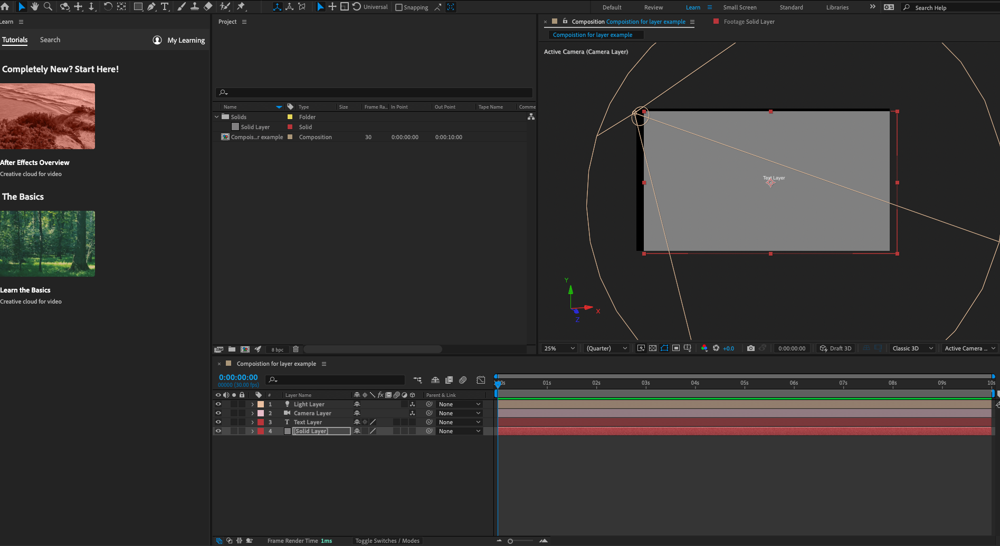
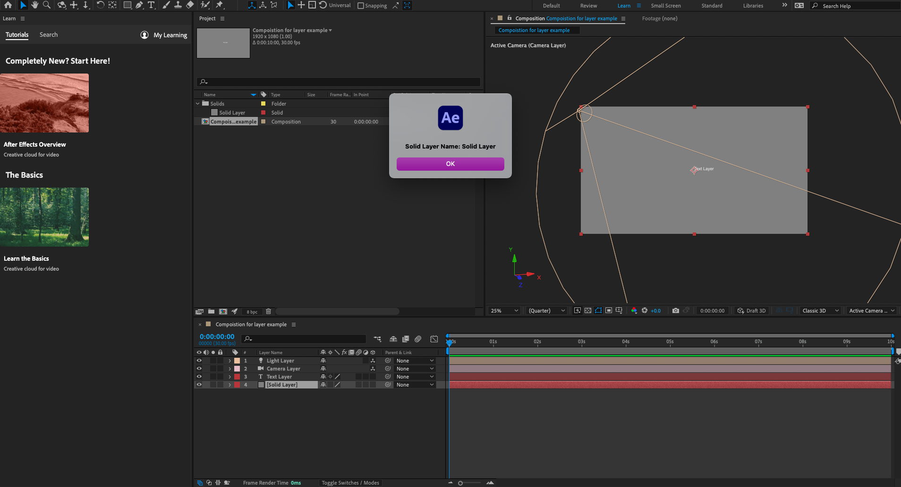
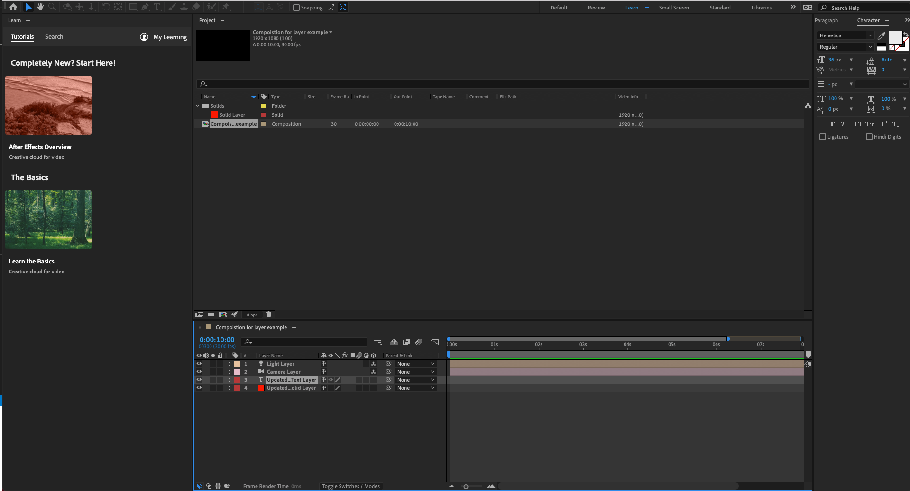
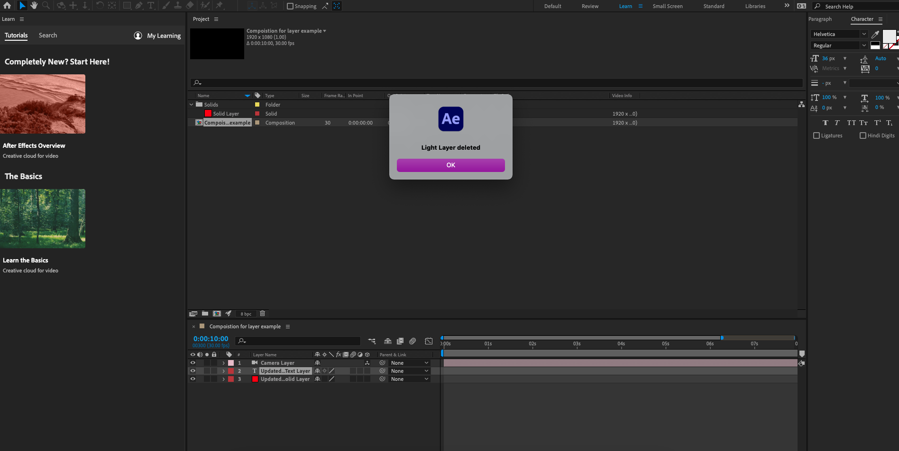

# Aftereffect layer crud examples

## Layer create
- First, you should create a project before the start.
- File -> Scripts -> Run Script File -> 02-layer/layer-create.jsx

### Function description
- https://ae-scripting.docsforadobe.dev/layers/layercollection.html#layercollection-addsolid
```javascript
// add solid function
app.project.item(index).layers.addSolid(color, name, width, height, pixelAspect[, duration])

// add text function
app.project.item(index).layers.addText([sourceText])

// add camera function
app.project.item(index).layers.addCamera(name, centerPoint)

// add light function
app.project.item(index).layers.addLight(name, centerPoint)

// add shape function
app.project.item(index).layers.addShape()
```

### Result screenshot
- 

## Layer read
- First, you should create a project before the start.
- Second, you should create a layer before the start. (`layer-create.jsx`)
- Third, you should select a layer before the start. (For activeLayer)
- File -> Scripts -> Run Script File -> 02-layer/layer-read.jsx

### Function description
- https://ae-scripting.docsforadobe.dev/layers/layercollection.html#

### Result screenshot
- 

## Layer update
- First, you should create a project before the start.
- Second, you should create a layer before the start. (`layer-create.jsx`)
- Third, you should select a layer before the start. (For activeLayer)
- File -> Scripts -> Run Script File -> 02-layer/layer-update.jsx
- I will use AVLayer for update example.

### Function description
- https://ae-scripting.docsforadobe.dev/layers/avlayer.html

### Result screenshot
- 

## Layer delete

### Result screenshot
- 